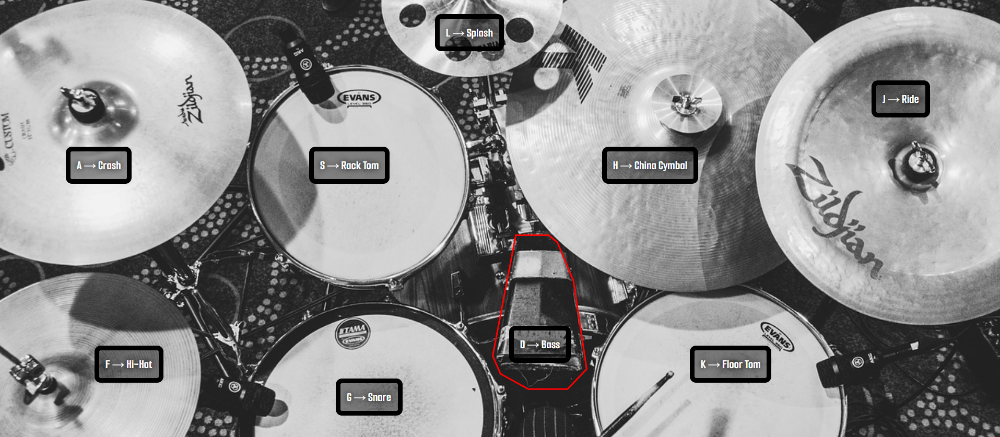

# Drum Kit Web Application

This is a Drum Kit web application where users can interact with a virtual drum set by clicking on different drum components or pressing corresponding keys on the keyboard.

## Features

- **Interactive Drum Kit**: The app features various drum components such as crash, rack tom, bass, hi-hat, snare, and others.
- **Keyboard Interaction**: Each drum component can be triggered by pressing a corresponding key (e.g., `A` for Crash, `S` for Rack Tom).
- **Visual Feedback**: When a drum is played, the visual component is highlighted to indicate interaction.
- **Responsive Design**: The layout is responsive and adapts to different screen sizes.

## Live Demo

Check out the live demo of the Drum Kit Web Application here:

[Live Demo](https://drum-kit-inky-six.vercel.app/)

## Screenshot



## Technologies Used

- **HTML**: Used for the structure and layout of the application.
- **CSS**: Applied for styling the page and making the layout visually appealing.
- **JavaScript**: Handles the functionality of playing the sounds and responding to user interaction (both mouse clicks and keyboard inputs).
- **SVG**: Scalable vector graphics are used to display the drum kit image on the screen.

## Installation

1. Clone or download the repository:
   ```bash
   git clone <https://github.com/j-ordanos/drumKit.git>
